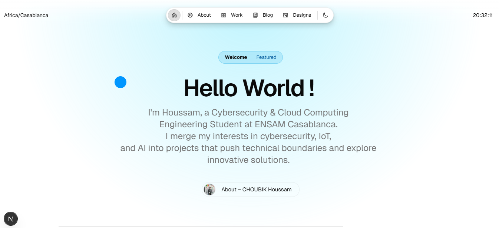

# Houssam Choubik – Personal Portfolio

Welcome to my personal portfolio! This site showcases my work, blog, and journey as a Cybersecurity & Cloud Computing Engineering Student at ENSAM Casablanca.



## 🚀 Features

- **Modern UI/UX**: Smooth mouse follower, scroll-to-top button, and responsive design
- **Blog**: Clean, welcoming blog section (with a single mockup post by default)
- **Projects**: Highlighted work and project pages
- **About**: My background, experience, and studies
- **Footer**: Social links including GitHub, LinkedIn, and Email
- **Newsletter**: Subscribe to my updates
- **Dark/Light Mode**: Seamless theme switching
- **SEO**: Automatic open-graph and metadata generation

## 🛠️ Getting Started

1. **Clone the repository**
   ```bash
   git clone https://github.com/H0ussamCl4p/portfolio.git
   ```
2. **Install dependencies**
   ```bash
   npm install
   ```
3. **Run the development server**
   ```bash
   npm run dev
   ```
4. **Customize your content**
   - Edit your info in `src/resources/content.tsx`
   - Add blog posts in `src/app/blog/posts/`
   - Add projects in `src/app/work/projects/`

## 📁 Structure

- `src/resources/content.tsx` – Personal info, social links, and config
- `src/app/blog/posts/` – Blog posts (MDX)
- `src/app/work/projects/` – Projects (MDX)
- `src/components/` – UI components


- [GitHub](https://github.com/H0ussamCl4p)
- [LinkedIn](https://www.linkedin.com/in/houssam-choubik-5b4ba3316/)
- [Email](mailto:choubikhoussam@gmail.com)

---

<div align="center">
   Made with ❤️ by Houssam Choubik
</div>


