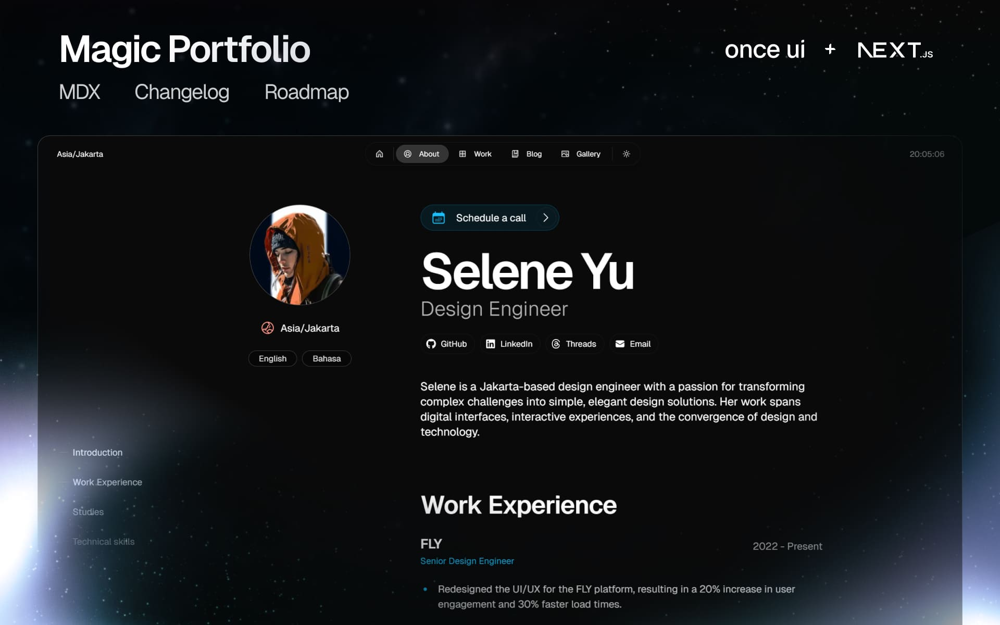

# Magic Portfolio

Magic Portfolio is a simple, clean, beginner-friendly portfolio template. It supports an MDX-based content system for projects and blog posts, an about / CV page and a gallery.

View the demo [here](https://demo.magic-portfolio.com).



## Getting started

**1. Clone the repository**

```
git clone https://github.com/once-ui-system/magic-portfolio.git
```

**2. Install dependencies**

```
npm install
```

**3. Run dev server**

```
npm run dev
```

**4. Edit config**

```
src/resources/once-ui.config.js
```

**5. Edit content**

```
src/resources/content.js
```

**6. Create blog posts / projects**

```
Add a new .mdx file to src/app/blog/posts or src/app/work/projects
```

Magic Portfolio was built with [Once UI](https://once-ui.com) for [Next.js](https://nextjs.org). It requires Node.js v18.17+.

## Documentation

Docs available at: [docs.once-ui.com](https://docs.once-ui.com/docs/magic-portfolio/quick-start)

## Features

### Once UI

- All tokens, components & features of [Once UI](https://once-ui.com)

### SEO

- Automatic open-graph and X image generation with next/og
- Automatic schema and metadata generation based on the content file

### Design

- Responsive layout optimized for all screen sizes
- Timeless design without heavy animations and motion
- Endless customization options through [data attributes](https://once-ui.com/docs/theming)

### Content

- Render sections conditionally based on the content file
- Enable or disable pages for blog, work, gallery and about / CV
- Generate and display social links automatically
- Set up password protection for URLs

### Localization

- A localized, earlier version of Magic Portfolio is available with the next-intl library
- To use localization, switch to the 'i18n' branch

## Creators

Lorant One: [Threads](https://www.threads.net/@lorant.one) / [LinkedIn](https://www.linkedin.com/in/lorant-one/)

## Get involved

- Join the Design Engineers Club on [Discord](https://discord.com/invite/5EyAQ4eNdS) and share your project with us!
- Deployed your docs? Share it on the [Once UI Hub](https://once-ui.com/hub) too! We feature our favorite apps on our landing page.

## License

Distributed under the CC BY-NC 4.0 License.

- Attribution is required.
- Commercial usage is not allowed.
- You can extend the license to [Dopler CC](https://dopler.app/license) by purchasing a [Once UI Pro](https://once-ui.com/pricing) license.

See `LICENSE.txt` for more information.

## Deploy with Vercel

[](https://vercel.com/new/clone?repository-url=https%3A%2F%2Fgithub.com%2Fonce-ui-system%2Fmagic-portfolio&project-name=portfolio&repository-name=portfolio&redirect-url=https%3A%2F%2Fgithub.com%2Fonce-ui-system%2Fmagic-portfolio&demo-title=Magic%20Portfolio&demo-description=Showcase%20your%20designers%20or%20developer%20portfolio&demo-url=https%3A%2F%2Fdemo.magic-portfolio.com&demo-image=%2F%2Fraw.githubusercontent.com%2Fonce-ui-system%2Fmagic-portfolio%2Fmain%2Fpublic%2Fimages%2Fog%2Fhome.jpg)

## Local testing & Vercel setup (GitHub stats)

This project can generate GitHub contribution stats at build time. The generator is optional for local dev and runs automatically in CI if a token is available.

Local (quick test)

1. Install deps:

```
npm install
```

2. To build locally and generate `public/github-stats.json`:

- In CI the generator uses the workflow-provided `GITHUB_TOKEN` and will run automatically.
- For local testing you can either set `GITHUB_TOKEN` in your environment or download the generated artifact from a workflow run and copy `github-stats.json` into `public/`.

Example (copy local artifact):

```powershell
Copy-Item .\artifacts\github-stats.json .\public\github-stats.json -Force
npm run build
```

Vercel (recommended CI flow)

1. In your GitHub repo settings, add these repository secrets:

   - `GITHUB_TOKEN` — provided by GitHub Actions at runtime; no personal PAT is required for CI runs.
   - `VERCEL_TOKEN` — (optional) Vercel personal token for deployments.
   - `VERCEL_PROJECT_ID` and `VERCEL_ORG_ID` — (optional) Vercel identifiers for the project.

2. The repository includes a `deploy-with-stats.yml` workflow that will:

   - download the latest `github-stats` artifact produced by the `generate-github-stats.yml` workflow,
   - extract it into `public/`,
   - run `npm run build`, and
   - deploy to Vercel if `VERCEL_TOKEN` is set.

3. Trigger the deploy workflow via the GitHub Actions UI or via `gh`:

```powershell
gh workflow run deploy-with-stats.yml --repo <your-repo> --ref main
```

Notes

- Do not commit `public/github-stats.json` — the repo ignores it and the workflows handle provisioning during build/deploy.
- Rotate any tokens if you accidentally exposed them earlier.

## Automate GitHub stats locally

You can run a small PowerShell helper that dispatches the `generate-github-stats.yml` workflow and downloads the artifact, or run the generator locally if you have `GITHUB_TOKEN` set in your environment.

Run the helper via npm:

```powershell
npm run auto:gen-stats
```

Options:

- `-RunWorkflow` — dispatch the `generate-github-stats.yml` workflow and download the artifact into `public/`.
- `-Debug` — run the local generator with `--debug` to print GraphQL/REST output.

Examples:

```powershell
# dispatch workflow and download artifact
npm run auto:gen-stats -- -RunWorkflow

# run local generator with debug output (requires GITHUB_TOKEN in env)
npm run auto:gen-stats -- -Debug
```
